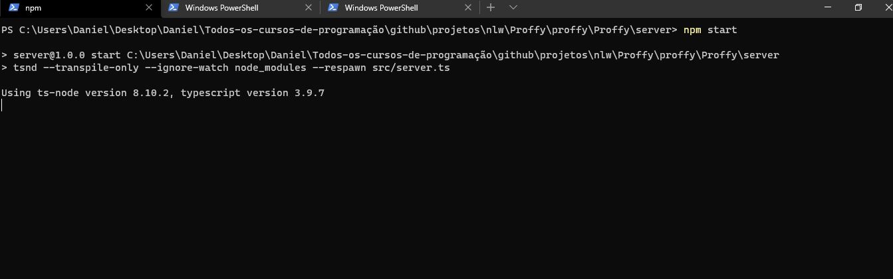
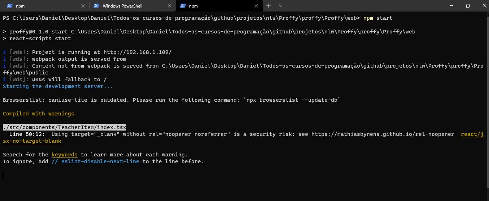
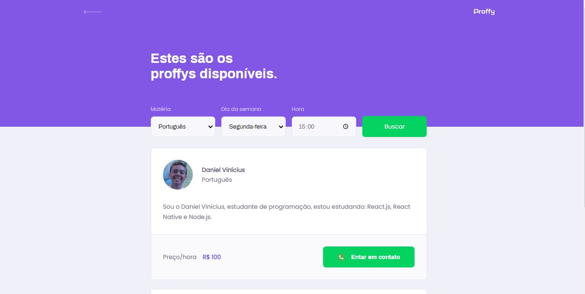

<p align="center">
  <a href="https://github.com/Daniel-Vinicius">
    
  </a>
  
<p>

<p align="center">
 <a href="#computer-sobre">Sobre</a> •
 <a href="#memo-roteiro">Roteiro</a> •
 <a href="#triangular_ruler-status-do-projeto">Status</a> •
 <a href="#movie_camera-demonstração">Demonstração</a> •
 <a href="#dvd-executar-o-projeto">Executar</a> •
 <a href="#hammer-tecnologias">Tecnologias</a> •
 <a href="#boy-autor">Autor</a> 
</p>

## :computer: Sobre

A plataforma é para estudantes e professores. Os professores realizam o cadastro inserindo as seguintes informações: Nome, biografia, whatsapp, disciplina e dias da semana com horários disponíveis para aula. Os alunos buscam professores particulares através do filtro de dia da semana, hora e matéria.

Projeto desenvolvido durante a **Next Level Week#2 (NLW)** na avançada **Trilha OminiStack** oferecida pela [Rocketseat](https://www.rocketseat.com.br).
O NLW é uma experiência online com muito conteúdo prático e desafios com duração de uma semana para conclusão.

---
### :memo: **Roteiro**

- [x] Construir página inicial :computer:
- [x] Construir página inicial :iphone:
- [x] Construir página de busca :computer:
- [x] Construir página de busca :iphone:
- [x] Construir página de cadastro :computer:
- [x] Construir página de cadastro :iphone:
- [x] Incluir novo horário no cadastro de professor :computer::iphone:
- [x] Construir servidor back end :computer:
- [x] Interface da página de busca dinâmica :computer:
- [x] Construir banco de dados :computer:
- [x] Criar consultas SQL :computer:
- [x] Construir funcionalidade de cadastrar professor no banco de dados :computer:
- [x] Construir funcionalidade buscar professor no banco de dados :computer:
- [x] Construir página de sucesso :computer::iphone:
- [x] Incluir página de sucesso no redirecionamento do cadastro :computer:

---
### :triangular_ruler: **Status do Projeto**

<h4 align="center"> 
	👨‍🏫 Proffy v1.0 concluído !
</h4>

---
### :movie_camera: **Demonstração**

<p align="center"><b> :iphone: MOBILE </b></p>

<div align="center">

Busca | Cadastro 
---|---
 |  |

</div>

<p align="center"><b> :computer: DESKTOP </b></p>

<p align="center"><kbd></kbd> <kbd></kbd></p>

### Pré-requisitos

Antes de começar, você vai precisar ter instalado em sua máquina as seguintes ferramentas:

<!--ts-->
 * <a target="_blank" href="https://reactjs.org">React</a> 
 * <a target="_blank" href="https://npmjs.com/">NPM</a> 
 * <a target="_blank" href="https://nodejs.org/pt-br/">Node</a> 
 * <a target="_blank" href="https://docs.expo.io/">Expo</a> 
 
 * <a target="_blank" href="https://www.devmedia.com.br/como-instalar-o-node-js-npm-e-o-react-no-windows/40329"> Como instalar Node, React e NPM</a>	
 * <a target="_blank" href="https://www.devmedia.com.br/primeiro-app-com-react-native/40737"> Como instalar Expo e React Native</a>
 <!--te-->

Além disto é bom ter um editor para trabalhar com o código como [VSCode](https://code.visualstudio.com/)

---
### :dvd: **Executar o Projeto**

```bash
# Clone este repositório
$ git clone <https://github.com/Daniel-Vinicius/Proffy>

# Acesse a pasta do projeto no terminal/cmd
$ cd Proffy

# Acesse a pasta server, instale as dependências e saia da pasta server
$ cd server
$ npm i
$ cd..

# Acesse a pasta web, instale as dependências e saia da pasta web
# Observação, serão encontradas 2 vulnerabilidades, devido a versão dos scripts do React,
# NÃO é recomendado a atualização para a versão mais recente neste projeto, pois pode gerar erros
$ cd web
$ npm i
$ cd..


# Acesse a pasta mobile, instale as dependências e saia da pasta mobile
# Observação, serão encontradas 14 vulnerabilidades, devido a versão das dependências do projeto,
# NÃO é recomendado a atualização para a versão mais recente neste projeto, pois pode gerar erros.
$ cd mobile
$ npm i
$ cd..

# Inicie o server
$ cd server
$ npm start

# Em outro terminal, inicie o web
$ cd web
$ npm start
```
🐱‍👤 Se para você apareceu uma mensagem parecida a essa nos terminais tudo deu certo, senão verifique se seguiu todos os passos

> Back-end ou Server


> Front-end ou Web


> ⚠️ Após executar o Server e o Web, o navegador padrão abrirá uma aba em <http://localhost:3000>. E é lá que você vai testar a aplicação. 😉
---

### **Testando a Aplicação Web**
Você está na aplicação e verá uma tela parecida a essa:


O banco já vem com um proffy e uma conexão (quando o usuário clica em entrar em contato) cadastrados, sou eu, preencha os dados como na imagem abaixo e veja se o retorno foi como esse:



Se tudo deu certo até agora, basta testar o cadastro, preencha os dados de uma forma parecida a essa:


Agora faça uma busca passando os filtros de acordo com o usuário que você acabou de cadastrar e veja se o retorno foi como o esperado.

---
### :hammer: **Tecnologias**

As seguintes ferramentas foram utilizadas na construção do projeto:

- [HTML5](https://developer.mozilla.org/pt-BR/docs/Web/HTML/HTML5)
- [CSS3](https://developer.mozilla.org/pt-BR/docs/Archive/CSS3)
- [Node.js](https://nodejs.org/pt-br/)
- [Express](https://expressjs.com/pt-br/)
- [SQLite](https://www.sqlite.org)
- [React](https://reactjs.org/)
- [React Native](https://reactnative.dev/)
- [Knex](https://knexjs.org/)

---
### :boy: **Autor**

<a href="https://github.com/Daniel-Vinicius">
 
 <br />
 <sub><b>Daniel Vinícius</b></sub></a> <a href="https://github.com/Daniel-Vinicius" title="Daniel Vinícius">💼</a>


Feito com ❤️ por Daniel Vinícius 👋 Entre em contato!

---
### :page_facing_up: **Licença**

Copyright © 2020 [Daniel Vinícius](https://github.com/Daniel-Vinicius).<br />
Este projeto é licenciado pelo [MIT](./LICENSE).
